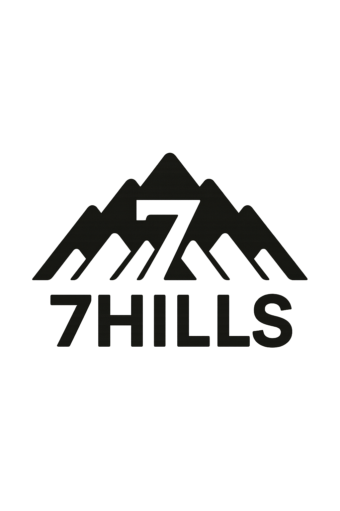

# Translate & Transliterate App

A modern React application for translating and transliterating text between English and multiple Indian languages. Features a beautiful animated globe (using [Cobe](https://github.com/shuding/cobe)), a custom animated particles background, and a clean, responsive UI styled with SCSS.

---

## Features

- **Translate** English text to 18+ Indian languages using the MyMemory API
- **Transliterate** the translated text to Latin script
- **Animated Globe** background (Globe)
- **Custom animated Particles** background (Canvas)
- **Responsive, modern UI** with SCSS
- **Language selection** with easy toggling

---

## Directory Structure

```
src/
  App.js                # Main app component
  index.js              # Entry point
  styles.scss           # Main SCSS styles
  components/
    field.js            # Input field and controls
    globe.js            # Animated globe (Cobe)
    languages.js        # Language selector
    particles.js        # Canvas-based particles background
    translate.js        # Translation and transliteration logic
public/
  index.html            # HTML template
  ...
```

---

## Getting Started

### 1. **Install dependencies**

```bash
npm install
```

### 2. **Run the app locally**

```bash
npm start
```

The app will be available at [http://localhost:3000](http://localhost:3000).

---

## Usage

- Enter English text in the input field.
- Click **Find** to translate and transliterate.
- Select a target language from the options.
- The translated and transliterated text will appear below.

---

## Customization

- **Languages:** Edit the `LANGUAGES` array in `src/components/languages.js` to add/remove languages.
- **Particles:** Adjust quantity, color, or animation in `src/components/particles.js`.
- **Globe:** Customize globe markers or appearance in `src/components/globe.js`.
- **Styling:** Modify `src/styles.scss` for theme and layout changes.

---

## Dependencies

- **React** (v19+)
- **Cobe** (animated globe)
- **axios** (API requests)
- **transliteration** (Latin script conversion)
- **SCSS** (styling)
- **react-scripts** (Create React App)

---

## License

This project is for educational/demo purposes. See individual package licenses for details.

---

## Credits

- [Cobe](https://github.com/shuding/cobe) for the globe visualization
- [MyMemory API](https://mymemory.translated.net/doc/spec.php) for translations
- [transliteration](https://github.com/dzcpy/transliteration) for script conversion

---

## Screenshots



---

## Author

Built by GowthamRaj.
